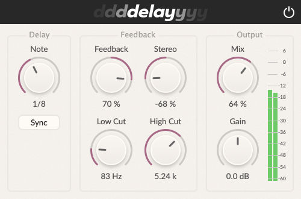

# Delay Plugin

Ping-pong delay with the settings:
* Delay length based on ms or Note length
* Feedback
* Stereo
* Lowcut and Highcut filter
* Mix
* Gain
* Bypass
* Metering

Built using JUCE 8 and the Projucer.

Based on the book The Complete Beginner's Guide to Audio Plug-in Development by Matthijs Hollemans.

